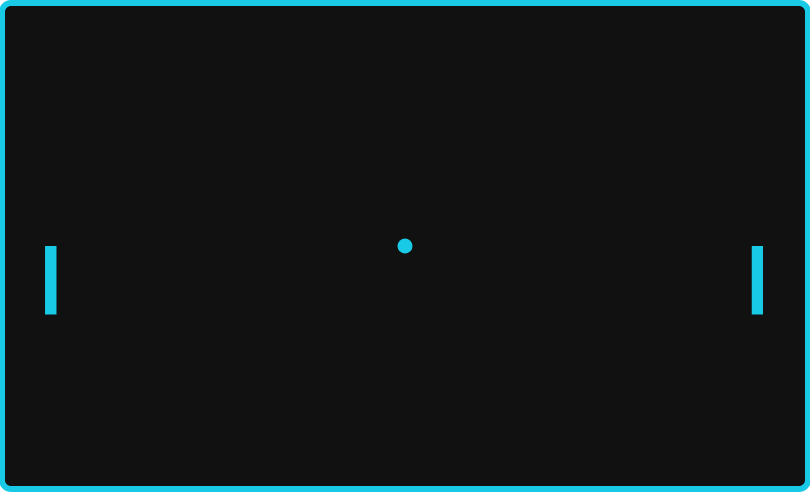

pongjs
======

Version of pong developed using HTML5 canvas. Pretty basic at this point but functional. Uses an MVC type structure.

Learned lots about the basics of the game and Canvas from <a href="http://billmill.org/static/canvastutorial/index.html">Bill Mill's Tutorial</a>